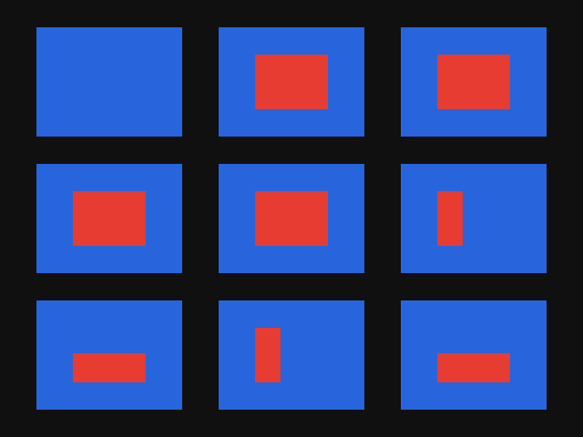
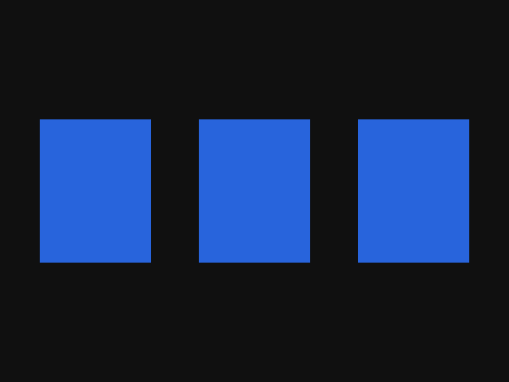
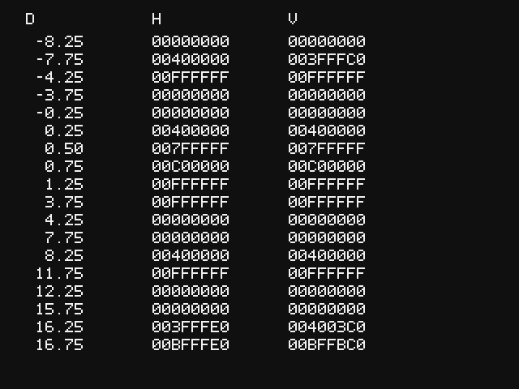

## Building

```sh
make                                # Build all tests
make z-freeze-depth                 # Build only one test
make PLATFORM=wii z-freeze-depth    # Build the Wii version
make clean                          # Remove build outputs
```

The Makefile uses devkitPPC/libogc when `DEVKITPPC` and `DEVKITPRO` are configured.
Otherwise it runs the build through Docker using `devkitpro/devkitppc:latest`.
GameCube DOLs are written to `build/` and Wii DOLs to `build/wii/`.

## Z-freeze

Found in:
* Mario Golf: Toadstool Tour
* Mario Power Tennis (the Plaza map)

The test draws 9 panels, read left to right and top to bottom:

| Row    | Left                                            | Center                                      | Right                                           |
| ------ | ----------------------------------------------- | ------------------------------------------- | ----------------------------------------------- |
| Top    | z-freeze off: solid blue                        | Flat triangle: full red center              | Flat quad: full red center                      |
| Middle | Flat fan: full red center                       | Flat strip: full red center                 | Horizontal triangle slope: red band on the left |
| Bottom | Vertical triangle slope: red band at the bottom | Horizontal quad slope: red band on the left | Vertical quad slope: red band at the bottom     |

The sloped cases exercise depth overflow. Clamping alone leaves full red centers, whereas wrapping directly to 24 bits produces repeated narrow stripes. The wider
bands above match the hardware result.

The original 2-panel version is available [here](https://github.com/ioncodes/gamecube-wii-tests/tree/be7a2e6f79d9691b9dd2c3308bf56dcf466e703b/z-freeze).



[FIFO capture](z-freeze/z-freeze.dff)

## Vertex-skip

Found in:
* Mario Golf: Toadstool Tour

Expected: three identical solid blue rectangles, from left to right:

- **Reference:** four direct vertices forming a triangle strip.
- **Index8:** the same strip with position index `0xff` inserted in the middle.
- **Index16:** the same strip with position index `0xffff` inserted in the middle.



[FIFO capture](vertex-skip/vertex-skip.dff)

## z-freeze depth readback

The reference triangle stays within depths 0.25-0.75. Its plane is evaluated
farther away to test values outside the normal depth range. Each sample uses
`GX_ALWAYS` with depth writes enabled, waits for `GX_DrawDone` and reads the
stored value with `GX_PeekZ`.

- **D:** calculated depth at the sampled pixel on the normalized scale.
- **H:** raw Z24 readback using a horizontal slope.
- **V:** raw Z24 readback using a vertical slope.

Wii testing with [hazelwiss](https://codeberg.org/hazelwiss) supports wrapping
into a signed 27-bit range before clamping to unsigned Z24. On the normalized scale,
this behaves like a range from -4 to just below +4, repeating every 8 units. For example,
4.25 becomes 0 after wrapping and clamping, while 8.25 comes back close to 0.25. The exact
internal representation is **not established**!! This is just my best effort guess lol.

[Hardware readbacks](z-freeze-depth/hardware-wii.csv) contain the values shown in
[hazelwiss' Wii photo](z-freeze-depth/hardware-wii.jpg). The image below was captured in Gecko and still
has precision differences in some in-range values.



[FIFO capture](z-freeze-depth/z-freeze-depth.dff)
